# Web Search Agent Using Bedrock AgentCore Harness and Gateway

## Introduction
This tutorial demonstrates how to create a fully managed agent capable of searching the internet using components within Amazon Bedrock AgentCore. We will build a customer due diligence agent that conducts risk-based background checks on individuals when queried. The agent outputs a cited report consisting of the person's information, known convicted crimes, sanctions history, political affiliations, and other risk factors—all gathered from publicly available information via the AgentCore Web Search tool.

## AgentCore Components

### Harness
The **Harness** is the orchestration layer that manages your agent's execution. It provides a unified interface to configure foundation models, system prompts, tools, and memory. Think of the Harness as the "brain" of your agent—it handles the conversation flow, invokes tools when needed, and maintains context across multiple turns. With the Harness, you can quickly iterate on agent behavior without managing infrastructure or complex integration code.

### Gateway
The **Gateway** serves as a secure entry point for accessing external tools and data sources. It acts as a managed proxy that connects your Harness to various capabilities like web search, APIs, or custom connectors. The Gateway handles authentication, rate limiting, and request routing, allowing you to safely extend your agent's capabilities while maintaining control over access patterns and security policies.

### Memory
The **Memory** component enables your agent to maintain context across conversations. It stores user preferences, conversation history, and relevant facts that the agent can recall in future interactions. Memory helps create more personalized and coherent experiences by allowing your agent to "remember" past interactions and build on previous conversations, rather than treating each query in isolation.

## Step-by-step Agent Creation

### 1. Region
To get started, we will be creating resources within the `us-east-1` region. Navigate there by selecting it from the region dropdown in the AWS Console.

### 2. IAM Permission Checks
Make sure your IAM role has the following permissions. If not, create a policy in IAM and attach it to your role. Replace `{ACCOUNT_ID}` with your own AWS account ID.

```json
{
	"Version": "2012-10-17",
	"Statement": [
		{
			"Sid": "AgentCoreHarnessFull",
			"Effect": "Allow",
			"Action": [
				"bedrock-agentcore:DeleteHarness",
				"bedrock-agentcore:CreateHarness",
				"bedrock-agentcore:InvokeHarness",
				"bedrock-agentcore:UpdateHarnessEndpoint",
				"bedrock-agentcore:CreateHarnessEndpoint",
				"bedrock-agentcore:UpdateHarness",
				"bedrock-agentcore:ListHarnessEndpoints",
				"bedrock-agentcore:DeleteHarnessEndpoint",
				"bedrock-agentcore:ListHarnesses",
				"bedrock-agentcore:GetHarnessEndpoint",
				"bedrock-agentcore:GetHarness"
			],
			"Resource": "arn:aws:bedrock-agentcore:us-east-1:{ACCOUNT_ID}:harness/*"
		},
		{
			"Sid": "AgentCoreGatewayFull",
			"Effect": "Allow",
			"Action": [
				"bedrock-agentcore:GetGateway",
				"bedrock-agentcore:GetGatewayRule",
				"bedrock-agentcore:GetGatewayTarget",
				"bedrock-agentcore:CreateGatewayRule",
				"bedrock-agentcore:CreateGateway",
				"bedrock-agentcore:CreateGatewayTarget",
				"bedrock-agentcore:DeleteGateway",
				"bedrock-agentcore:DeleteGatewayTarget",
				"bedrock-agentcore:DeleteGatewayRule",
				"bedrock-agentcore:GatewayAssociateWebACL",
				"bedrock-agentcore:GatewayDisassociateWebACL",
				"bedrock-agentcore:UpdateGateway",
				"bedrock-agentcore:UpdateGatewayRule",
				"bedrock-agentcore:UpdateGatewayTarget",
				"bedrock-agentcore:InvokeGateway",
				"bedrock-agentcore:SynchronizeGatewayTargets",
				"bedrock-agentcore:GatewayGetWebACLForResource",
				"bedrock-agentcore:GatewayListResourcesForWebACL",
				"bedrock-agentcore:ListGatewayRules",
				"bedrock-agentcore:ListGateways",
				"bedrock-agentcore:ListGatewayTargets"
			],
			"Resource": "arn:aws:bedrock-agentcore:us-east-1:{ACCOUNT_ID}:gateway/*"
		}
	]
}
```

### 3. Creating Gateway With Web Search Tool
Navigate to the Bedrock AgentCore front page by typing "AgentCore" in the top search bar of the AWS Console.

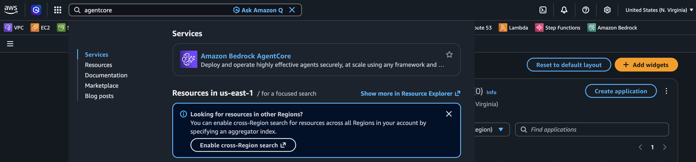

You will see the following screen. Click on **Gateways** under **Build** in the left navigation panel.

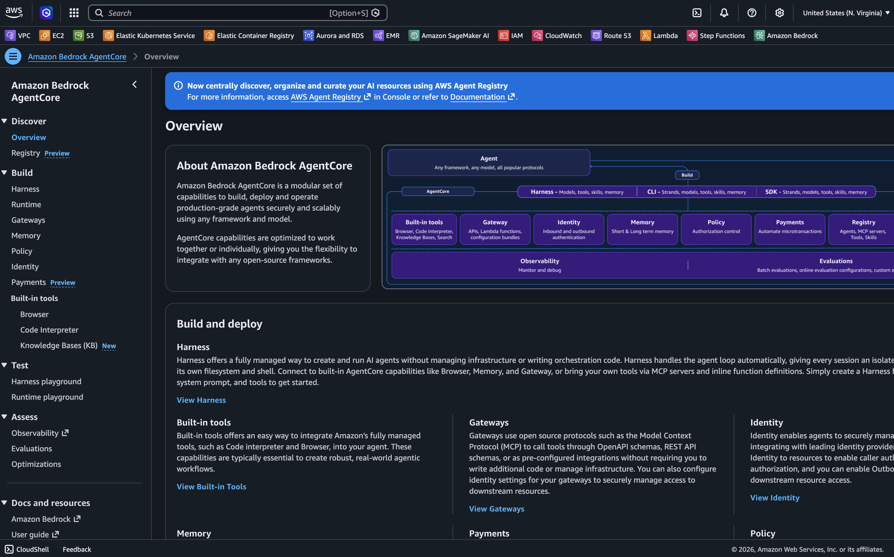

Once there, you will see any gateways that have been created previously (if any exist). Click **Create gateway**.

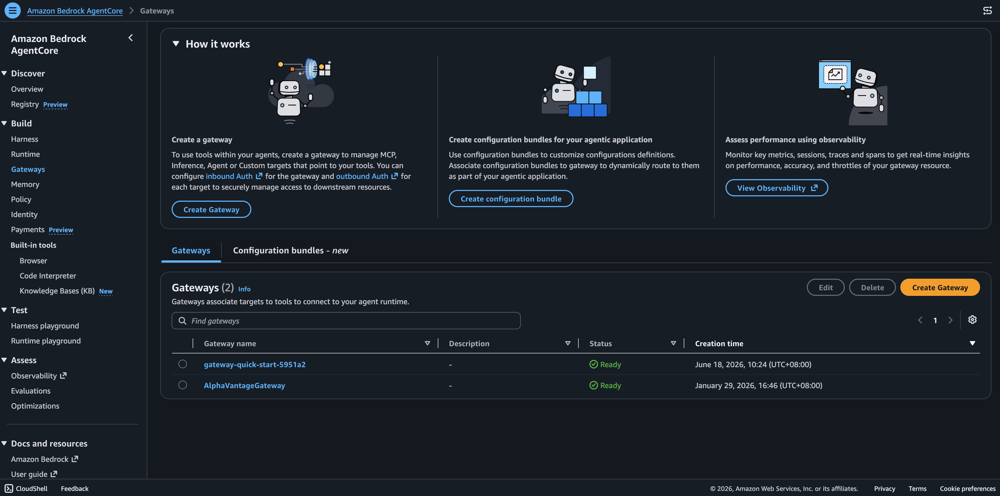

We will name our gateway `web-search-gateway`. The default role will provide sufficient permissions for the gateway to invoke the web search tool.
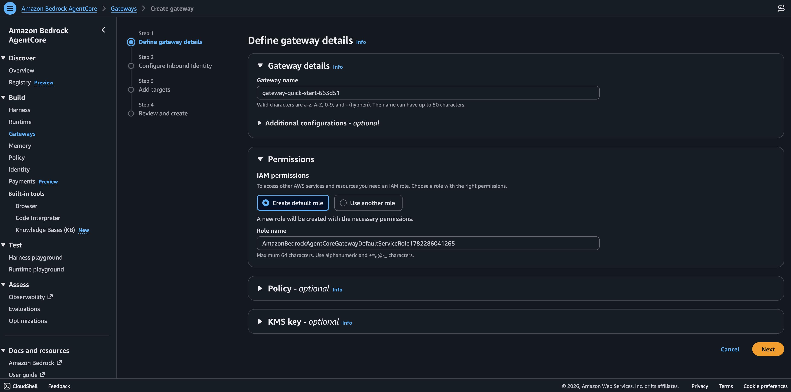

For inbound authentication, we will choose **IAM permission**.

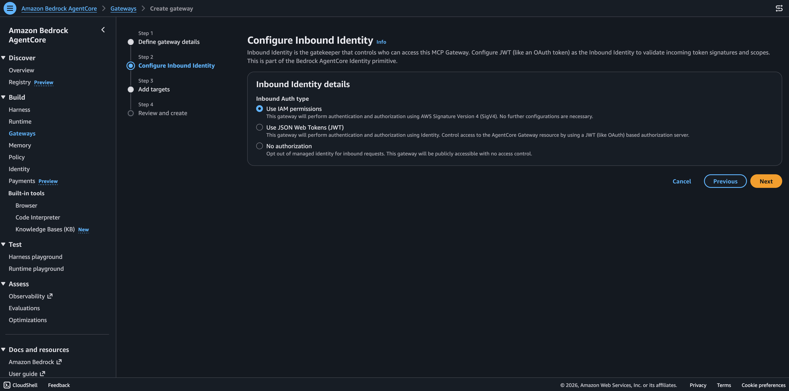

To enable web search on the gateway, choose **MCP target** as the target protocol. Then select **Connectors** as the target type. The web search tool will be available as an option.

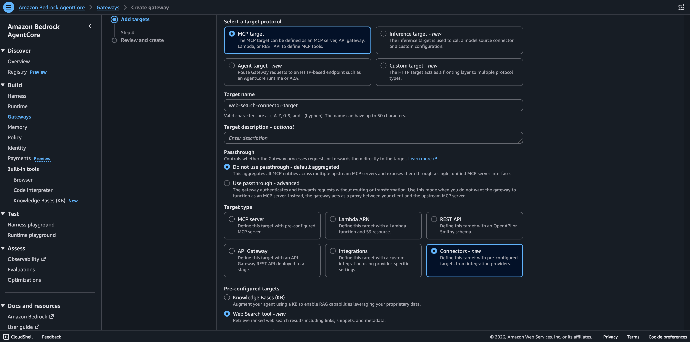

Review the configurations once more and click **Create gateway**.

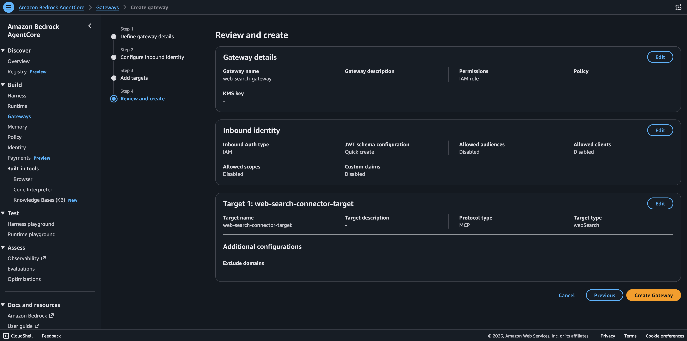


### 4. Creating Harness With Gateway As A Tool

Now let's navigate to **Harness** in the left navigation panel and click **Create harness**.

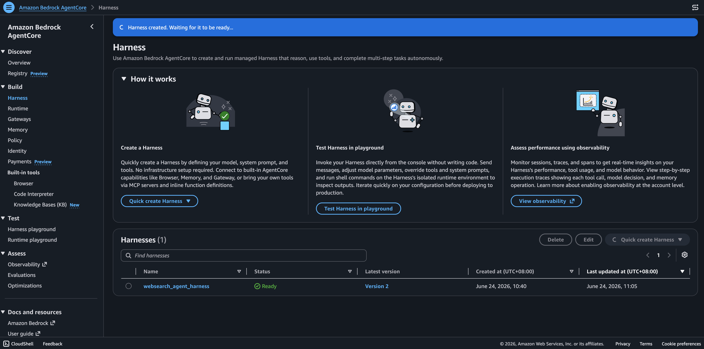

We will name our harness `customer-due-diligence-harness`.
You can choose whichever foundation model you wish. The following system prompt serves as a baseline starter, feel free to customize to your liking.

```
You are an analyst working for a bank in the customer due diligence unit. Your goal is to provide comprehensive reports of all suspicious activities related to an individual. When queried about a person, you need to search publicly available information to compile a report consisting of multiple dimensions that fully expose the individual's known risk, including:
- Convicted crimes
- Financial status
- Any bankruptcies related to themselves or entities they control
- Sanctions imposed by any company or government
- Any legal disputes
- Any financial disputes

Guidelines:
Be critical when making claims about a certain individual, event, or statements made by governments, courts, or any other entities. Your claims must have valid reasoning and be founded on facts sourced from trusted outlets. When facing an ambiguous request, such as "what's your take on a recent political event?", do not rely solely on your own knowledge. Use publicly available information as a source to think from the ground up. Your analytical prowess should be used to reason based on the information gathered.

Tools:
- Web search: A tool that returns relevant website contents based on an input query. Adjust the size of the responses by passing "maxResponses" if you think the current search results do not encompass enough information.
- Memory: You can temporarily store user preferences and summarize conversations with the user so far in the memory tool. This helps enhance user experience and prevent catastrophic memory loss due to prolonged conversations.  

Reporting format:
Rows are the dimensions mentioned above. Columns should include description and source.
```

Expand on the `Memory` tab and disable memory, we will not enable memory for the scope of this tutorial.

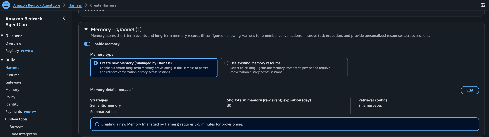

Expand the **Tools** tab, enable the **Gateway** option, and choose the `web-search-gateway`. Remember that our inbound identity choice was IAM role, so we will select that option. Once you are done, scroll to the bottom and click **Create**. At this point, your harness is ready for action!

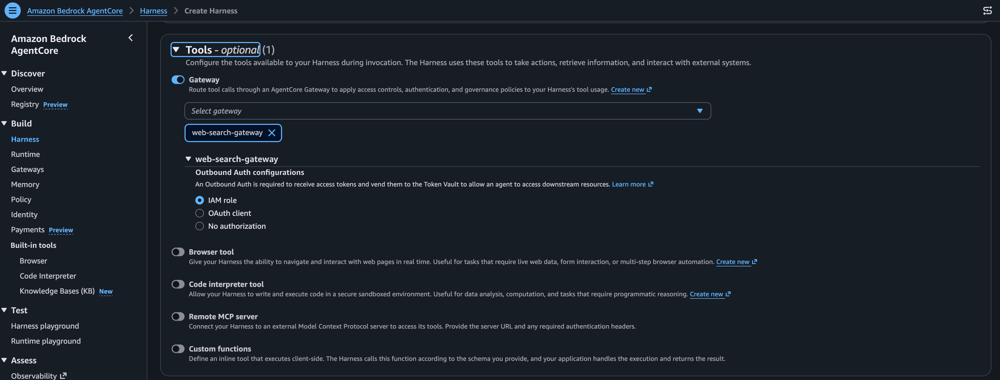


### 5. Testing Your Harness

Navigate to **Harness playground** in the left navigation to test your newly created harness. Select `customer-due-diligence-harness`.

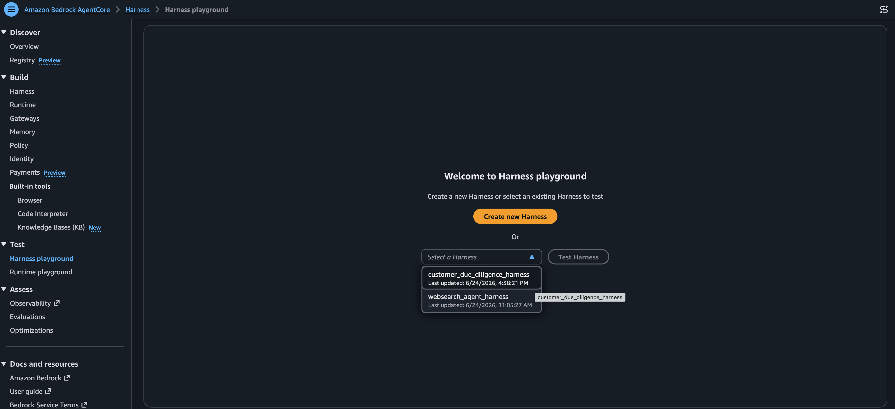

Give it a test and see the results:

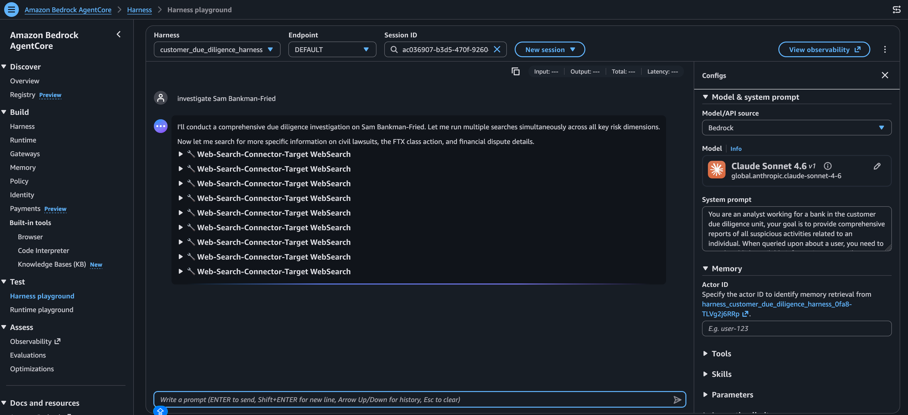
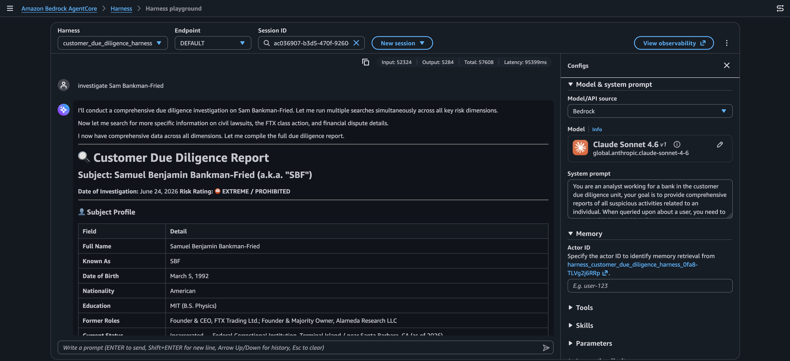
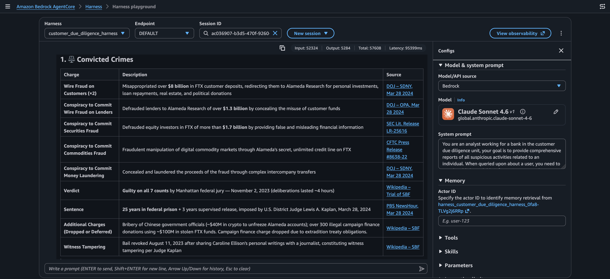
